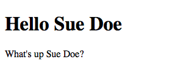
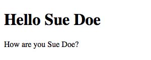

# SketchMark
## A JavaScript Experiment
## *** ALPHA Development - not suitable for production use ***
### A library that behaves like a view library for website content

This experiment attempts to provide a solution to creating dynamic/reactive content for websites, but with less focus on the JavaScript and more on the markup.

That is to say, writing valid HTML markup, which the library will pick up and update, when needed, without having to make complex DOM traversals.

## Motivation

Front end view libraries and frameworks do a great job of building highly responsive, reactive, performant and slick user interfaces. They work great for building SPAs, because these are generally  mostly complex UIs that load content into a viewer of some sort.

However, for websites, which are generally composed more of content with simpler UIs, these types of solutions introduce a few specific challenges:

- Big JavaScript bundles - Where the structures holding the content are client side generated (i.e. components), the JS bundles that are downloaded and executed grow larger, which generally leads to...
- Lots of main thread work - This can lead to significant performance impacts.
- Content is not part of the HTML markup - this can have certain SEO implications for websites, where SEO is a big factor to it's success, leading to the need for...
- Server Side Rendering - In order to ensure content is delivered in the HTML response so it can be crawled as well as improve speeds for first contentful paint. This brings about the need for...
- Elaborate toolchaining and build pipelines - So that the JavaScript components can be rendered as static markup to be served to the client, and the JavaScript bundles can then be downloaded to 'hydrate' the views with reactive components

This means that in most cases where it is the site's content that is the subject of these components, and the components are operating on a multipage website, potentially with no central state management, which will reinitialise everything for every page load - there's a lot of overhead for what should be a simple effect. It's sort of like using a sledge hammer to hammer in a panel pin.

## Goals/Objectives

- Be a library (not a framework) for building dynamic content, not UI: most view libraries are great for, and/or are specifically designed around building reactive and dynamic UIs and SPAs, not reactive and dynamic content for websites and PWAs.
- Write HTML first: most view libraries and front end frameworks work JS -> HTML, we wanted to see if it could be more HTML -> JS
- Make it work just as well without a toolchain or build pipeline: most libraries can be used without a build pipeline, but they are better when in one. We wanted something where we can write plain ole’ html + JS, without any need or benefit gained from compiling or building anything. - i.e. you should be able to write things with extreme ease using nothing but a plain text editor.
- Leverage multithreaded JavaScript and be performance minded: We wanted a solution that would make the most of Web Workers, doing most of the logic in a separate thread, and only using the main thread when unavoidable or else carries to much overhead.

## What about Web Components?

Web Components are great, especially in how they use the shadow DOM. However, they rely on a collection of technologies which requires templates to be downloaded, along with the JavaScript functions that will use them to create custom components used on the page.

They have the same issue as not being server side rendered, as well as requiring that extra markup be sent down the line in the form of unrendered templates, which increases page weight.

## Alternatives

Other ways of dynamically updating content are centered around templating systems or heavy DOM traversal and manipulation.

The former means more bytes for the templates just as with Web Components templates.

The latter means a performance hit as DOM manipulations are expensive; if these traversals are not limited by verifying that changes are actually needed, that hit has bigger impacts. Another issue with this type of solution, is that the code to apply the content change is typically not reusable as they deal with individual DOM nodes, this can lead to large blocks of code that are hard to maintain.

## Hypothesis

If static website content is written using only valid, semantic HTML markup, then a library can derive a template/markup structure and data model from it, which is easy to work with to dynamically update the content, because the static markup contains all the information necessary to serve as template and model.

## Usage

### Write valid, Contentful HTML

Start with writing valid HTML that includes the content you need initially

```html
<div>
    <h1>Hello <span>World<span></h1>
    <p><span>What's up</span> <span>World</span>?</p>
</div>
```


Add specific atttributes to describe the markup as a data object.

First, at the root element of your 'template' add a SketchMark source identifier:

```html
<!-- your-page.html -->
<div
    data-sm-source="app"
>
    <h1>Hello <span>World<span></h1>
    <p><span>What's up</span> <span>World</span>?</p>
</div>
```

Then for the textual content you want to make dynamic, add SketchMark content directives with whatever identifier you want. These can be anything and can be shared across elements under the root:

```html
<!-- your-page.html -->
<div
    data-sm-source="app"
>
    <h1>Hello <span data-sm-content="name">World<span></h1>
    <p><span data-sm-content="greeting">What's up</span> <span data-sm-content="name">World</span>?</p>
</div>
```

### Add the SketchMark JS file
```html
<!-- your-page.html -->
<div
    data-sm-source="app"
>
    <h1>Hello <span data-sm-content="name">World<span></h1>
    <p><span data-sm-content="greeting">What's up</span> <span data-sm-content="name">World</span>?</p>
</div>
<script src="/path/to/sketchmark.js"></script>
```

### Initialise the SketchMark view in your JS
```html
<!-- your-page.html -->
<div
    data-sm-source="app"
>
    <h1>Hello <span data-sm-content="name">World<span></h1>
    <p><span data-sm-content="greeting">What's up</span> <span data-sm-content="name">World</span>?</p>
</div>
<script src="/path/to/sketchmark.js"></script>

<script>
    const MyView = new SketchMark('app');
</script>
```


### Set the appropriate property to update the view

The `SketchMark` instance that is returned is an object with getters and setters of the directives used.

```html
<!-- your-page.html -->
<div
    data-sm-source="app"
>
    <h1>Hello <span data-sm-content="name">World<span></h1>
    <p><span data-sm-content="greeting">What's up</span> <span data-sm-content="name">World</span>?</p>
</div>
<script src="/path/to/sketchmark.js"></script>

<script>
    const MyView = new SketchMark('app');

    console.log(MyView.name); // 'World'
    console.log(MyView.greeting); // 'What\'s up'
</script>
```

To update the view, simply assign a new value to the desired property:

```html
<!-- your-page.html -->
<div
    data-sm-source="app"
>
    <h1>Hello <span data-sm-content="name">World<span></h1>
    <p><span data-sm-content="greeting">What's up</span> <span data-sm-content="name">World</span>?</p>
</div>
<script src="/path/to/sketchmark.js"></script>

<script>
    const MyView = new SketchMark('app');

    MyView.name = 'Sue Doe';
</script>
```


```html
<!-- your-page.html -->
<div
    data-sm-source="app"
>
    <h1>Hello <span data-sm-content="name">World<span></h1>
    <p><span data-sm-content="greeting">What's up</span> <span data-sm-content="name">World</span>?</p>
</div>
<script src="/path/to/sketchmark.js"></script>

<script>
    const MyView = new SketchMark('app');

    MyView.name = 'Sue Doe';

    MyView.greeting = 'How are you'
</script>
```


### Repeating Content

The `content` directive deals with strings and will coerce all supplied values to strings, but if any property used with it is supplied an array, the element will be repeated for each element in the array with it's value set as the text content.

```html
<!-- your-page.html -->
<div
    data-sm-source="list-app"
>
    <ul>
        <li data-sm-content="items">Foo</li>
    </ul>
</div>
<script src="/path/to/sketchmark.js"></script>

<script>
    const MyList = new SketchMark('list-app');

    MyList.items = ['Foo', 'Bar', 'Baz'];
</script>
```

